# Debug a docker driven tomcat java web application

This repository is built as shown on 

    https://blog.docker.com/2016/09/java-development-using-docker/

## Installation steps (on mac, with docker toolbox)

### Install Java

Install the Java SE Development Kit to your local machine in order to build source code.

    http://www.oracle.com/technetwork/java/javase/downloads/jdk8-downloads-2133151.html

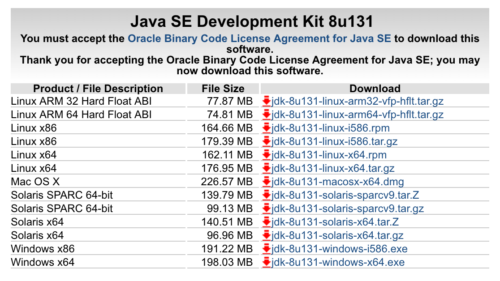

An alternative could be to use a docker container for compiling:

    https://hub.docker.com/_/openjdk/

### Download IntelliJ IDEA

https://www.jetbrains.com/idea/download/#section=mac

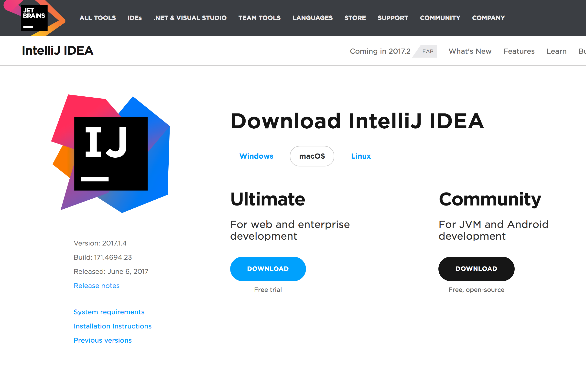

### Install Docker/Docker-Compose

Install either docker toolbox or docker for mac.

https://docs.docker.com/compose/install/

For better access on mounted filesystem install docker-machine-nfs:

https://github.com/adlogix/docker-machine-nfs

### Create a host entry

```bash
sudo nano /etc/hosts
```

Add another entry like (docker toolbox)

```
192.168.99.100  dev.project.io
```

or 

```
127.0.0.1  dev.project.io
```

### Clone this project

```bash
cd /your/projects/folder

git clone git@github.com:shockwavemk/tomcat-debug-template-app.git
```

## Startup of project

Start up intelliJ IDEA and open your cloned folder:

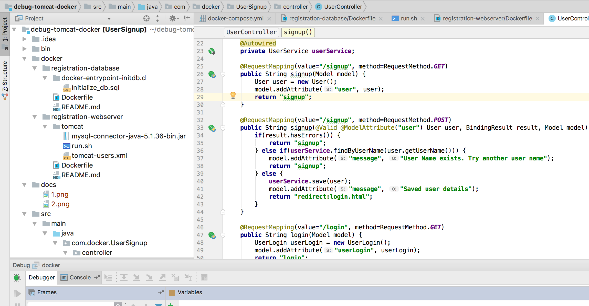

### Docker

Open the terminal,

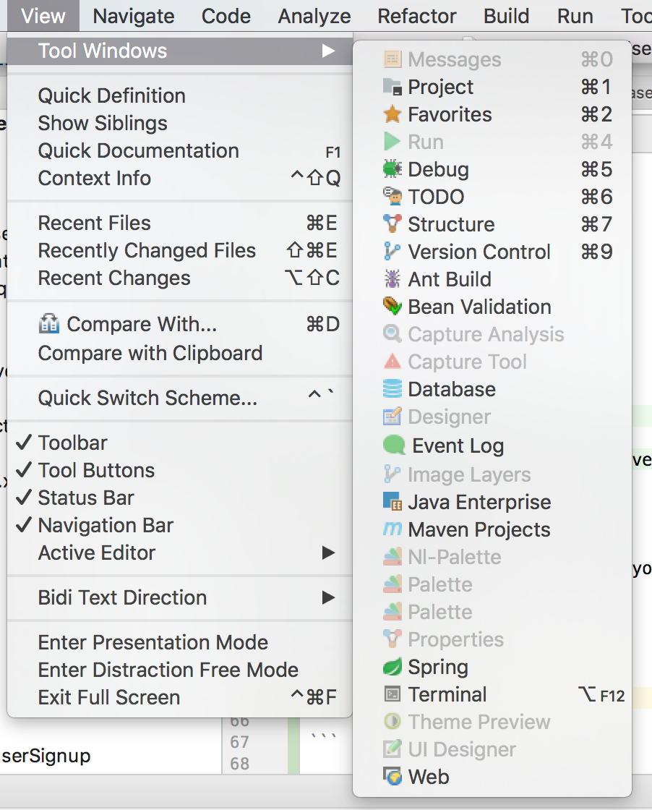

and start docker containers with:

```
docker-compose build
docker-compose up -d
```

If not yet started, docker will notice to startup docker machine:

```
docker-machine start
eval "$(docker-machine env default)"
```

The following ports are used in this project:

- 80 for tomcat webserver
- 8000 for debug
- 3306 for mysql

### Build the project

Build the project (Build > Build Project)

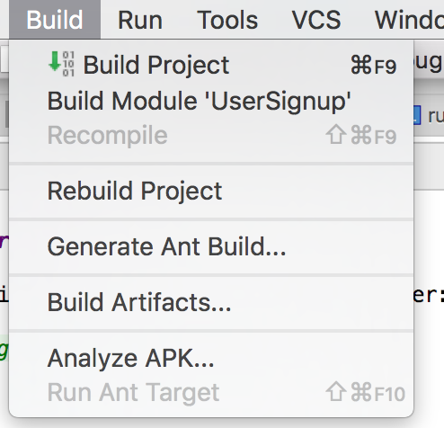

### Configure remote debugging

Go to Run > Debug,

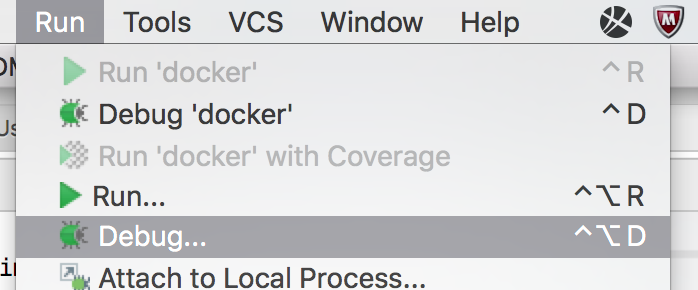

and configure a new "remote" entry:

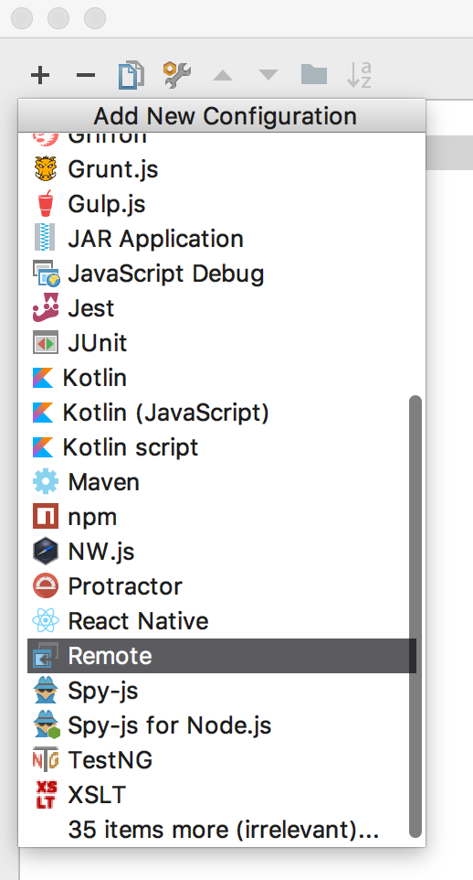

Most needed configurations are already inserted by IntelliJ IDEA, but two values have to be changed:

- Change host to: dev.project.io
- Change port to: 8000

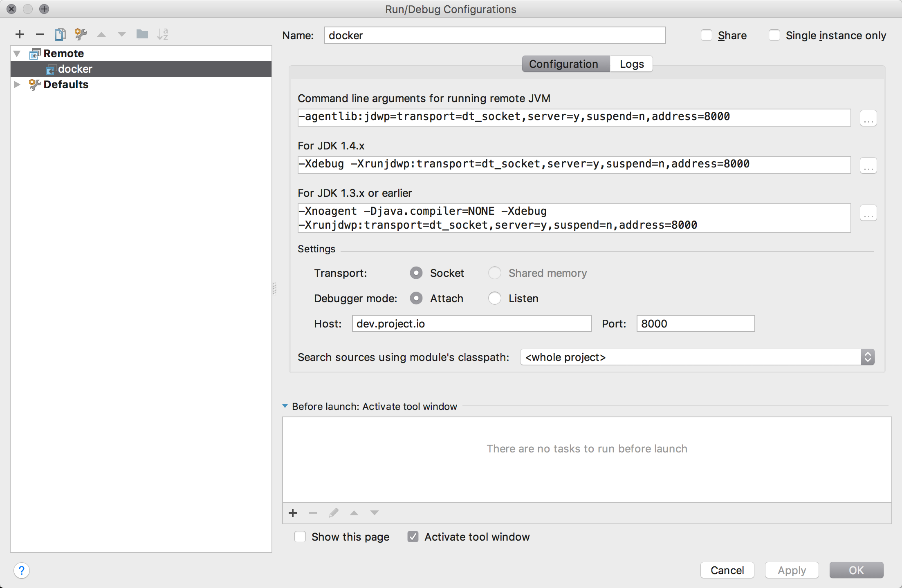

### Database edit in IntelliJ IDEA

Open the database window:

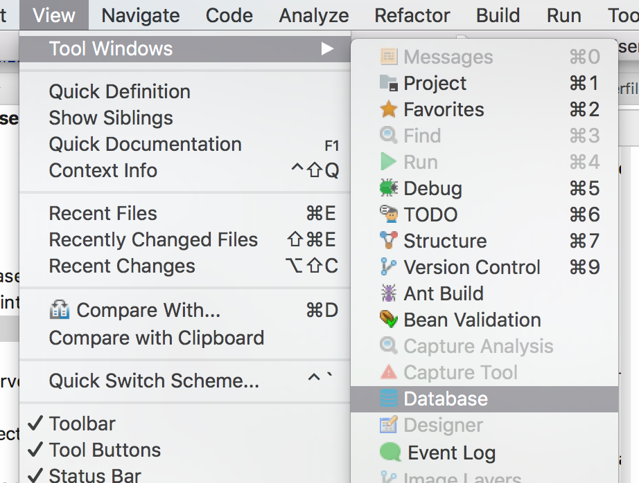

Add a new entry,

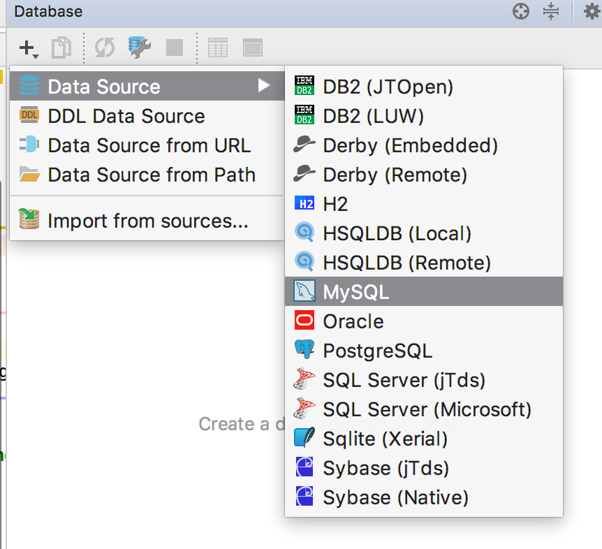

download the missing driver for mysql,

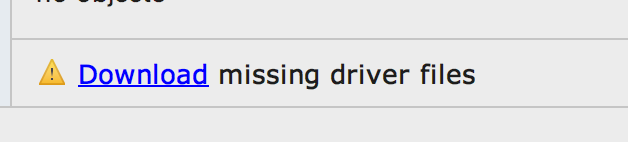

and configure the mysql docker container bound to localhost / docker-machine:

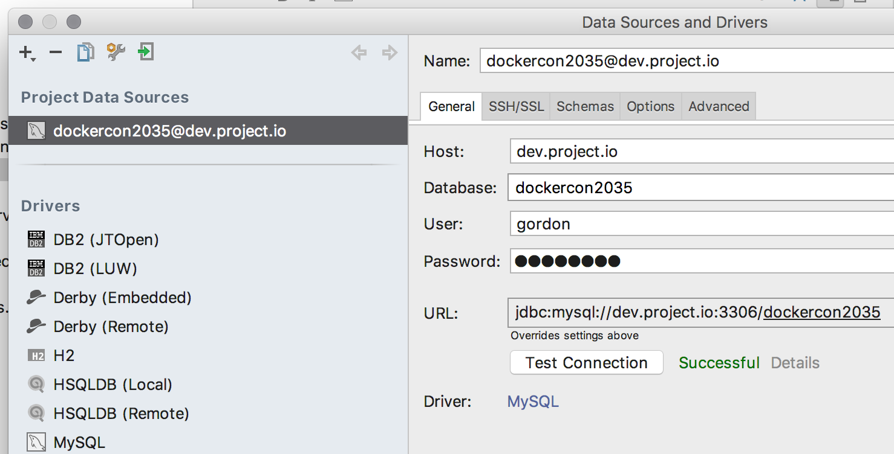

Current docker-container config reveals the username/password:

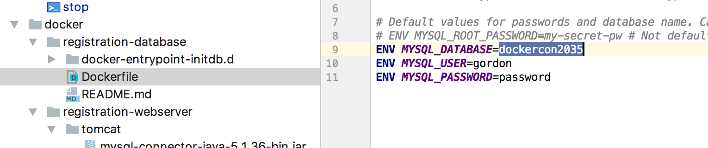


## Debug the project

Start the debugging session with a click onto the green bug:

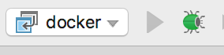

A new tool window should appear with a "connected" message:

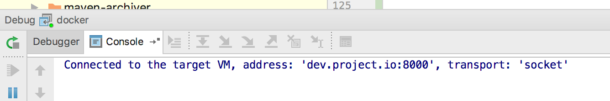

Open your web-browser to open the web-application:

    http://dev.project.io/manager/html
    
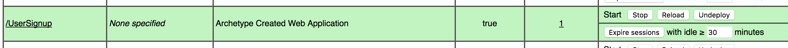

The docker-application is hosted behind the a sub-path called /UserSignup.
A click onto the link will lead you to the start window of the demo-application:

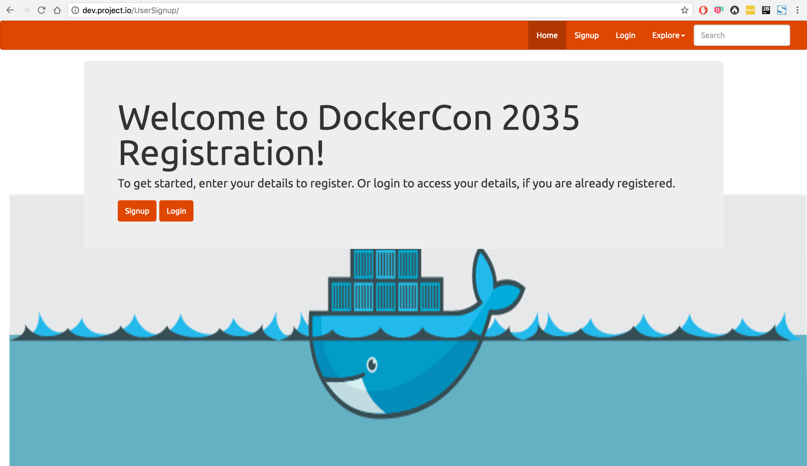 

In the code editor window open the controller class "UserController".
Mark the line 27 with a breakpoint:

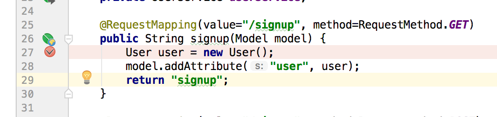 


Navigate to the address 

    http://dev.project.io/UserSignup/signup.html

in your web-browser:

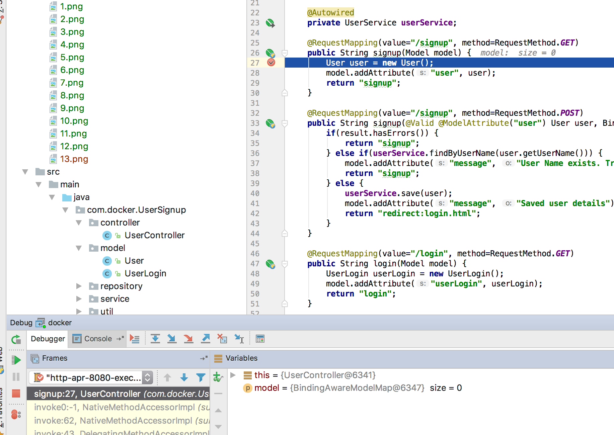 

The application execution should stop at breakpoint, IntelliJ IDEA should show breakpoint details and active variables.

## Hints

Template changes are not immediately done in web-site, even on execution of "build".
All assets are saved in a file called UserSignup.war.

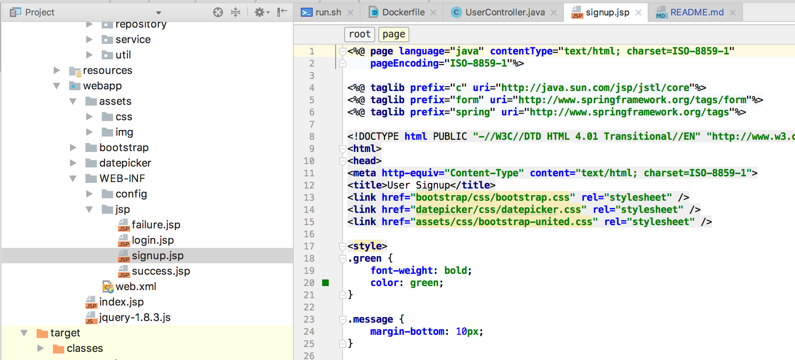 

This file can be recompiled by Build > Build Artifacts ... > All artifacts

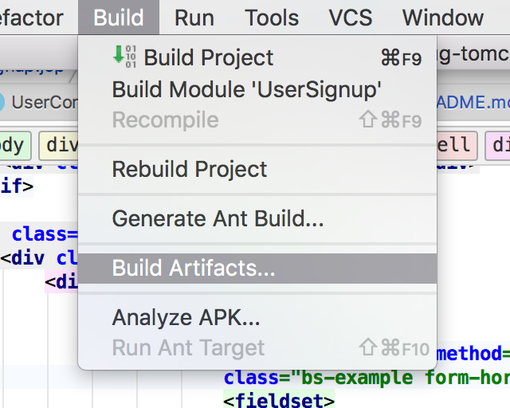 